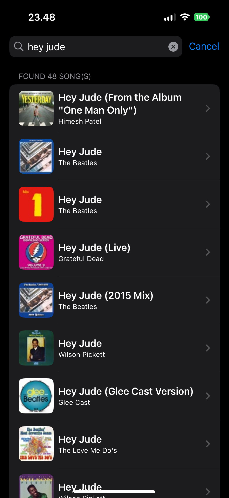
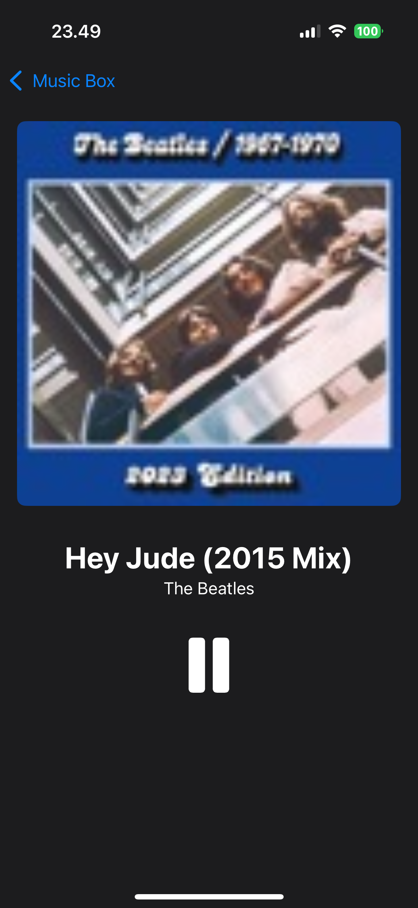
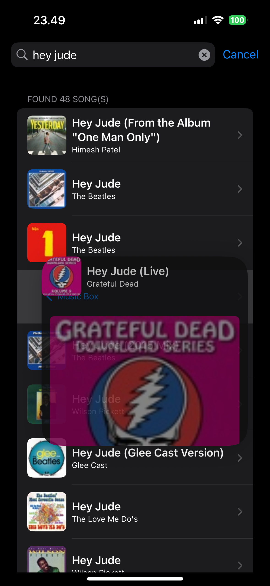

# Music Box
Catalog of iTunes songs with seamless playback and intuitive controls.

## Setup
1. Clone the repository: `git clone https://github.com/vinncz/music-box.git`
2. Navigate to the project directory: `cd music-box`
3. Install dependencies: `carthage bootstrap --platform iOS --use-xcframeworks`
   - If Carthage is not installed, install it via Homebrew: `brew install carthage`
4. Run it on physical device or simulator.

## Screenshots




## Highlights
1. Preloading:
   - Playback starts immediately when a song is selected (no buffering).
2. Caching:
   - Songs are cached after the first play.
   - Subsequent plays are instantaneous and offline-friendly.
3. Documentation:
   - Well-documented codebase for easy understanding and maintenance.
4. Lintings:
   - Consistent code style and formatting.
   - Improved code quality and readability.
5. Unit Tests:
   - Ensures reliability and correctness of the code.
   - Facilitates future enhancements and refactoring.

## Project Structure
```
MusicBox
|-- Core
|   |-- Models
|   |   |-- Domain and Storage
|   |   |-- Transport
|   |-- Services
|   |   |-- CatalogService
|   |   |-- MediaCacheService
|   |   |-- MediaPlaybackService
|   |   |-- MetadataCacheService (incomplete)
|   |-- Utilities
|-- Features
    |-- Catalog
    |-- Player

MVVM + Clear Architecture pattern, with modern Swift 6 features (async/await, actors, property wrappers, etc.)
```
